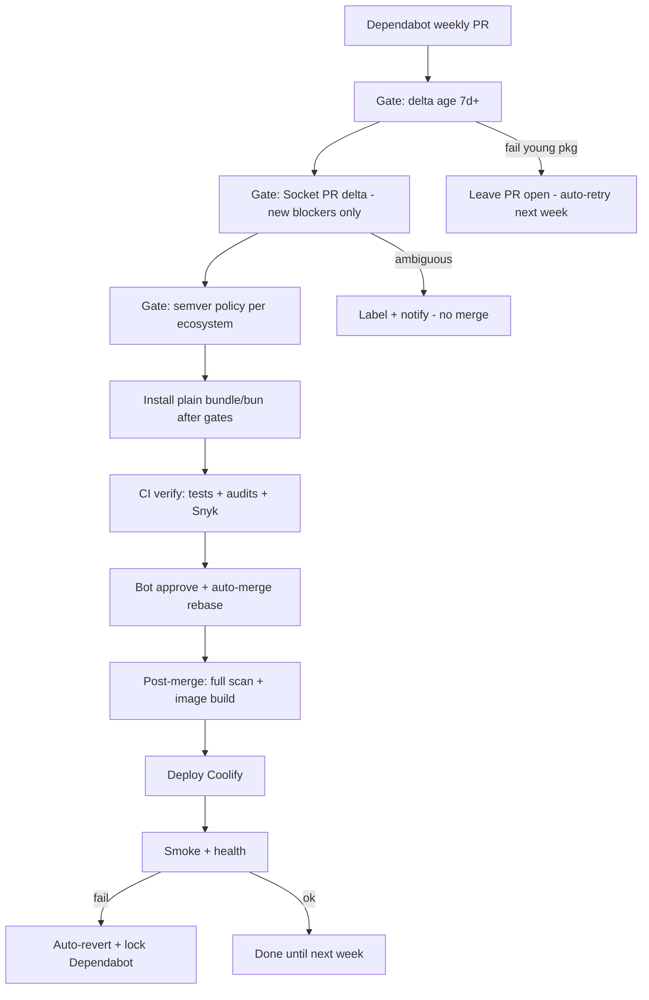

# Autonomous dependency rolling (design)

Design for **perpetual, review-free** dependency updates on Libreverse-Legacy: Dependabot PRs merge and deploy to production with **zero human approval**, as long as machine-verifiable gates pass. Humans are notified only when automation **cannot** reach a safe decision (stuck PR, policy conflict, rollback) — not for routine bumps.

**Status:** Phases 1–5 are **wired in repo** but **not production-ready** until the [finalization checklist](#finalization-checklist) below is complete. Do **not** rely on Socket Firewall Enterprise — this project uses **Socket Free** (CLI scans + optional local **Firewall Free** for npm/pip) and **Snyk Free** (quota-managed SCA/SAST/container), alongside existing CodeQL, brakeman, and audits.

Enable rolling when checklist items through **CI green on a Dependabot PR** are done:

- Repository variable `AUTODEP_MERGE_ENABLED=true` (optional `AUTODEP_MAJOR_MERGE_ENABLED=true` for majors).
- Secrets: `SOCKET_API_KEY` (scans only), `SNYK_TOKEN` (after Snyk wired), `APP_ID`, `APP_PRIVATE_KEY`, plus existing deploy secrets.
- Optional: `DEPLOY_HEALTH_URL` (defaults to `https://libreverse-legacy.geor.me/up`; smoke runs after Cloudflare bypass).

**TiDB pause (2026):** Serverless TiDB free tier is exhausted; the instance is shut down until credits reset (~June). Set `TIDB_INSTANCE_AVAILABLE=false` while paused. When `false`, CI skips `rails-test` and **Build & Deploy** (Quay, Coolify, smoke, rollback). Gates and patch/minor auto-merge on PRs can still run. Set `TIDB_INSTANCE_AVAILABLE=true` when the database is back.

**Related:** [package-age-gates workflow](.windsurf/workflows/package-age-gates.md), `.github/dependabot.yml`, `.github/workflows/auto-approve.yml`, `.github/workflows/ci.yml`

---

## Design goal

Confidence comes from **stacked automated gates**, not from reviewing diffs.

| Principle | Meaning |
|-----------|---------|
| No review | No required PR approvals; bots merge when checks pass |
| Fail closed | If uncertain → do not merge (PR waits or auto-closes) |
| Fail safe in prod | Smoke failure → auto-revert + pause Dependabot |
| Self-healing | Stale PRs retry on schedule; young packages wait for age |

---

## What broke (May 2026)

Socket.dev added an **obfuscated code** check that produced many false positives on legitimate minified dependencies. The pipeline treated failures like hard blocks; auto-merge waited on checks; rolling was panic-disabled.

Follow-up CI work exposed more issues (see [CI failure log](#ci-failure-log-may-2026-for-reference)):

1. **Enterprise Socket assumed** — `SOCKET_API_KEY` triggered `sfw bundle`/`bun` without a Firewall Enterprise license.
2. **Age gates timing** — lockfile-wide hooks run at install time; **delta** gates in CI are the real PR gate (implemented).
3. **CI job order** — gates → install → verify is implemented; matrix must skip when install fails.
4. **Auto-approve race** — fixed: poll only gates / install / verify.
5. **Artifact / restore** — gem `?` in paths, frozen lockfile fallback.
6. **Socket policy** — PR delta + `socket-policy-filter.mjs` implemented; post-merge full scan still fragile.
7. **TiDB paused** — deploy/smoke/rails-test off until ~June 2026.

---

## Target pipeline



**Rule (free tier):** Nothing **merges** until **delta age gate** + **Socket PR scan** + **Snyk Open Source (PR)** + **verify** pass. CI install runs **after** lockfile-only gates; Ruby/Bun are **not** wrapped in Socket Firewall in CI (Enterprise-only). Local dev may use [Socket Firewall Free](https://github.com/SocketDev/sfw-free) for `npm` / `pip` / `cargo` only.

---

## Security stack (Socket Free + Snyk Free)

Two vendors, one boundary: **merge gates**, not install-time blocking for gems/Bun.

| Layer | Tool | Role | Quota / notes |
|-------|------|------|----------------|
| Time | Delta age scripts | New `(name, version)` must be 7d+ (14d for major) | No vendor quota |
| Supply chain (behavior) | **Socket** `socketcli` + `socket-policy-filter.mjs` | Malware, typosquat, compound obfuscation rules | Free API key; **1 scan per Dependabot PR** in gates — avoid full-repo scan every `main` push |
| CVEs (deps) | **Snyk Open Source** + `bundle-audit` / `npm-audit` | Known vulns in lockfiles | **200 tests/month** org — run **once per PR**, not per matrix job |
| SAST (app code) | **CodeQL** (GitHub), **brakeman**, optional **Snyk Code** | Custom code issues | Snyk Code **100/month** — weekly or PR-label, not every commit |
| Container | **Snyk Container** | Image before/after deploy | **100/month** — only in `build-push` when deploy runs |
| IaC | **Snyk IaC** | If infra manifests exist in repo | **300/month** — low priority unless needed |
| Local + CI **Bun install** | **`@socketsecurity/bun-security-scanner`** in `bunfig.toml` | Scan each package during `bun install` / `bun add` (Bun ≥ 1.3) | Free mode without API key; optional `SOCKET_API_KEY` (`packages` scope) for org policy |
| Local proactive (other PMs) | **Socket Firewall Free** (`sfw`) | `sfw npm` / `sfw pip` / etc. | Not used for Bun in this repo — use Bun scanner instead |
| **Ruby gems** | Age gate + `bundle-audit` + Snyk OS | No Free install-time wrapper for `bundle` | Accept residual risk or Enterprise `sfw bundle` later |
| Install in CI | Plain `bundle` + `bun` (Bun picks up scanner from `bunfig.toml`) | After gates pass | No Enterprise `sfw` |

### Socket: four mechanisms (do not confuse)

| Mechanism | Tier here | Use in this repo |
|-----------|-----------|------------------|
| **Bun security scanner** (`@socketsecurity/bun-security-scanner`) | Free (public API) or API key | **Enabled** — `[install.security]` in `bunfig.toml`; requires Bun ≥ 1.3 |
| **Firewall Free** (`sfw` CLI) | Local npm/pip/cargo | Optional elsewhere; **not** used for Bun installs here |
| **Firewall Enterprise** (`sfw bundle` / `sfw bun`, `firewall-enterprise` action) | **Not licensed** | **Remove** from CI install, Docker, and `install-dependencies` action |
| **CLI / GitHub App** (`socketcli`, API key) | Free (limited scans) | **Keep** — PR delta in `gates` job; optional App for PR comments |

**Why Bun install-time scan without Ruby:** npm/JS is a larger malware target and this repo carries far more JS transitive deps (~1.3k resolved in `bun.lock`) than gems (~hundreds in `Gemfile.lock`). Gems still rely on delta age gate + `bundle-audit` + Snyk on PRs.

The Bun scanner is **not** `sfw bun` (Enterprise). It hooks [Bun’s Security Scanner API](https://bun.com/docs/pm/security-scanner-api) and blocks/warns on supply-chain signals during install — complementary to `socketcli` on PRs (which does not replace `bun audit` / CVE tools).

### What free tiers do **not** cover

- Install-time blocking for **Ruby + Bun** in CI/Docker (Enterprise Socket only).
- Snyk **license compliance** and **SBOM** on Free.
- Unlimited scans — budget Socket + Snyk on **Dependabot PRs** and sparse `main`/deploy jobs.

### Division of labor (gaps filled together)

```text
Dependabot PR
  → age gates (yours)
  → Socket socketcli delta + policy filter
  → Snyk Open Source (once)
  → semver / major rules
  → install (plain bundle/bun)
  → verify (tests, brakeman, audits, CodeQL)
  → auto-merge

main / deploy (when TiDB on)
  → Snyk Container on built image
  → smoke + optional rollback
  → Snyk Code on schedule (optional)
```

---

## Layer 1 — Time gate

**Dependabot:** 8-day cooldown (`.github/dependabot.yml`) — keep aligned with age gate.

**Delta age gate (7 days):** On PR open, diff lockfiles against `main` and check **only new** `(name, version)` pairs via registry APIs. **No install required.**

| Script | Purpose |
|--------|---------|
| `scripts/bun-age-gate-delta.mjs` | New packages in `bun.lock` vs base ref |
| `scripts/gem-age-gate-delta.rb` | New gems in `Gemfile.lock` vs base ref |

- Too young → PR stays open; weekly cron re-runs gates until versions age in.
- Replace or supplement lockfile-wide checks in `scripts/bun-age-gate.mjs` / `scripts/gem-age-gate.rb` for PR/CI use.

**Automation:** `schedule` workflow re-runs gates on open Dependabot PRs (Mondays).

---

## Layer 2 — Socket.dev (PR supply-chain gate)

### A. Install-time firewall — **deferred (Enterprise only)**

Original design required **Socket Firewall Enterprise** (`sfw bundle` / `sfw bun`) on every install surface. This account has **Firewall Free** locally (npm/pip/cargo) and **no Enterprise** license. CI must use **plain** `bundle install` / `bun install` via `setup-environment` after gates pass.

| Surface | Target (free tier) |
|---------|-------------------|
| CI install job | Plain `bundle` / `bun` only — **never** `install-dependencies` + `firewall-enterprise` |
| Dockerfile | Plain install; remove Enterprise `docker-sfw-setup.sh` / `socket_api_key` for bundle/bun unless upgraded |
| Local dev | Optional `sfw npm` / `sfw pip` (Firewall Free); document that **gems/Bun are not covered** |

Do **not** tie `SOCKET_API_KEY` to the install job — the key is for **scans only**.

Optional later: `socketdev/action` with `mode: firewall-free` only on explicit `sfw npm ci` steps if added.

Remove or stop maintaining `.sfw.config` `[firewall] enabled` as an Enterprise CI contract (Free firewall is zero-config).

### B. PR delta scan (automated policy, not full-repo block) — **keep**

On Dependabot `pull_request` / `pull_request_target`:

- Run `socketcli` (or GitHub App integration) with **new alerts only** vs baseline scan from last green `main`.
- Store baseline scan ID in repo artifact or small committed metadata file updated by bot after each successful prod deploy.

**Policy tiers (machine-enforced):**

| Category | Merge action | Notes |
|----------|--------------|-------|
| Malware, protestware, install-script takeover | **Block** | |
| Typosquat / namespace confusion (high confidence) | **Block** | |
| Obfuscated code **alone** | **Warn / ignore** | Fixes false-positive storm |
| Obfuscation **+** lifecycle script change in same package | **Block** | Shai-Hulud pattern |
| License / maintenance / reputation | **Ignore** | Log only |
| CVE (reachable) | **Block** patch/minor; defer major to semver rules | Pair with bundle-audit / npm-audit |

**No routine manual allowlist:** use compound rules. Optional: treat `package@version` already on `main` for N days as baseline-safe.

### C. Post-merge full scan — **quota-aware**

`socket-post-merge.yml` full-repo `socketcli` + baseline commit is **expensive** (scan quota + GitHub ruleset blocks bot push to `main`). Prefer:

- PR delta only for merge decisions, **or**
- Scheduled weekly baseline refresh with GitHub **App** token (same pattern as `autofix.yml`), **or**
- Snyk monitor + smoke rollback instead of Socket full-scan revert.

If kept: run on schedule or after deploy, not on every push; fix push auth before relying on it for auto-revert.

---

## Layer 2b — Snyk (CVE + container + optional SAST)

Wire **Snyk Free** without burning monthly caps.

| When | Command / integration | Cap (org/month) |
|------|---------------------|-----------------|
| Dependabot PR (gates job) | `snyk test` or Snyk PR check — **once** per PR | Open Source **200** |
| `main` deploy job | `snyk container test` on image tag | Container **100** |
| Weekly cron | `snyk code test` | Code **100** |
| IaC (if applicable) | `snyk iac test` on infra paths | IaC **300** |

**Rules:**

- One OS test ≈ one Dependabot PR, not one per lint matrix row.
- Keep `bundle-audit` / `npm-audit` as fast redundancy or demote after Snyk is stable.
- Add `SNYK_TOKEN` secret; enable Snyk GitHub integration optional (watch duplicate PR comments vs Socket App).

---

## Layer 3 — Semver automation (no human for major)

| Bump type | Auto-merge | Extra gates |
|-----------|------------|-------------|
| `github-actions` | Yes | Prefer SHA pins where possible |
| Patch (bundler / npm / docker) | Yes | Standard stack |
| Minor | Yes | Rails test + Jest green |
| **Major** | **Conditional** | Age ≥ **14 days**; Socket delta clean; smoke + build; optional CHANGELOG `BREAKING` → defer 14d and retry |

**Major safety signals (all automated):**

- App boot / routes smoke (`rails runner` or dedicated smoke suite)
- `bun run build` succeeds
- Lockfile diff size cap (reject huge accidental lock churn)
- Parse upstream CHANGELOG for `BREAKING` → defer, do not block forever

Failed major → label `automerge-deferred`; weekly cron retries.

---

## Layer 4 — CI architecture (strict order)

**Problem today:** `package-age-gates` runs **in parallel** with jobs that call `setup-environment` and install first.

**Target jobs:**

| Job | Depends on | Installs? | Work |
|-----|--------------|-----------|------|
| `gates` | — | **No** | Delta age, Socket PR delta, semver classifier |
| `install` | `gates` | Yes, **plain** bundle/bun | Upload cache artifact (see checklist: fix `?` in gem paths) |
| `verify` | `install` | No (use cache) | Tests, brakeman, bundle-audit, npm-audit, CodeQL |
| `deploy` | `verify` (on `main` push only) | Docker plain install + Snyk container | Build, Quay push, Coolify |

- Re-enable `build-push` `needs: [gates, install, verify]` (or equivalent workflow_run).
- `autofix.yml` runs on `main` after merge only; not on Dependabot branches.
- Concurrency: `dependabot-${{ github.head_ref }}` to serialize bot PRs.

---

## Layer 5 — Auto-approve / auto-merge

Repair `.github/workflows/auto-approve.yml`:

```yaml
on:
  pull_request_target:
    types: [opened, synchronize, reopened]
  schedule:
    - cron: "0 6 * * 1"  # retry stale Dependabot PRs
  workflow_dispatch:
```

- GitHub App token (`APP_ID`, `APP_PRIVATE_KEY`) — merges not tied to a human account.
- Approve + `gh pr merge --rebase --delete-branch --auto` after required checks: `gates`, `verify`.
- Poll only **Dependency gates**, **Install dependencies**, **Verify (aggregate)** before `gh pr merge --auto` (race fix — do not use `gh pr checks --watch --fail-fast` on all checks).

**Branch protection:** No required human reviewers. Required status checks = automated gates only.

---

## Layer 6 — Production safety

### Deploy gate

- Deploy only on `push` to `main` when `verify` passed for that commit.
- Skip `chore(autofix)` commits (existing pattern).
- Do not deploy Dependabot merge commits if `verify` did not run on the merge SHA (use `workflow_run` if needed).

### Post-deploy smoke + rollback

After Coolify redeploy:

1. HTTP health check (e.g. `/up`), 3 retries.
2. Optional: lightweight DB connectivity check.

**On failure:**

1. Bot `git revert` merge commit on `main`.
2. Redeploy previous image tag (store last-good deploy UUID in repo variable / secret).
3. Label `dependabot-paused`; comment with Socket scan IDs and CI links.
4. One webhook/email notification — automation halted.

---

## Layer 7 — False positives self-resolve

1. **Compound rule:** obfuscation alone never blocks; lifecycle-script change blocks.
2. **Baseline inheritance:** same `package@version` already on `main` → not a “new” alert on transitive-only bumps.
3. **API retries:** Socket flake → retry 3×, then fail closed (no merge).
4. **Chronic stuck PR:** fails gates 3+ weeks → bot closes PR with comment; Dependabot may reopen later.

**Optional:** Socket `patch` mode for verified CVE patches — bot commits patch, re-runs gates, merges.

---

## Layer 8 — Observability (minimal human attention)

| Signal | When |
|--------|------|
| Weekly digest (GitHub Issue or email) | “Merged N deps, M rollbacks, K stuck” |
| Alert (webhook) | Rollback, `dependabot-paused`, gates broken 7+ days |
| Socket + Actions dashboards | Optional |

**SLO:** ≥95% of Dependabot PRs merge within 14 days without human touch.

---

## Perpetual mode summary

| Component | Target state |
|-----------|--------------|
| Dependabot | On (weekly + 8d cooldown) |
| Auto-approve / merge | On after gates fixed |
| Socket Firewall Enterprise | **Off** (not licensed) |
| Socket Firewall Free | Optional local npm/pip only |
| Socket PR delta (`socketcli`) | On, tuned policy, quota-aware |
| Snyk Open Source | On PRs (once per PR) |
| Snyk Container | On deploy when TiDB on |
| Age gates | Delta-only, pre-install |
| Human PR review | Off |
| Human notification | On for halt/rollback only |

---

## Implementation phases

| Phase | Autonomy | Deliverables |
|-------|----------|--------------|
| **1** | Partial | Fix `auto-approve` triggers; add `gates` workflow (delta age + Socket delta); **no merge yet** |
| **2** | High | CI job order; Socket obfuscation compound policy; **no Enterprise `sfw`**; Snyk OS on PRs |
| **3** | Full patch/minor | Auto-merge patch/minor; deploy `needs` verify; post-deploy smoke |
| **4** | Full major | Major rules + deferred retry cron |
| **5** | Self-healing | Post-merge scan regression → auto-revert |

Phase 3 = “runs forever” for typical churn. Phases 4–5 harden edge cases.

---

## Honest limits

Unattended automation cannot guarantee zero incidents. This design:

- Minimizes merge risk (age + Socket + Snyk + verify before merge; Enterprise install-time firewall optional future upgrade)
- Avoids alert fatigue (delta + compound rules)
- Recovers from bad merges (smoke + revert)
- Fails closed when uncertain (no merge)

Expect **monthly digests** and **rare halt alerts**, not per-PR notifications.

---

## Current repo inventory (reference)

| Artifact | Role | Keep? |
|----------|------|-------|
| `.github/dependabot.yml` | Weekly updates, 8d cooldown | Yes |
| `scripts/bun-age-gate-delta.mjs` / `gem-age-gate-delta.rb` | PR delta age | Yes |
| `scripts/socket-policy-filter.mjs` | Socket SARIF policy | Yes |
| `.socketcli.toml` | Socket CLI config | Yes |
| `.github/socket-baseline.json` | Scan baseline | Yes (update path TBD) |
| `.github/workflows/auto-approve.yml` | Bot approve/merge | Yes (fixed race) |
| `.github/workflows/ci.yml` | Gates → install → verify → deploy | Yes (needs finalization) |
| `.github/workflows/dependency-gates-retry.yml` | Weekly gate retry | Yes |
| `.github/workflows/socket-post-merge.yml` | Full scan + baseline | Defer / fix push + quota |
| `.github/actions/setup-environment` | Plain install | **Yes — default install path** |
| `.github/actions/install-dependencies` | Enterprise `sfw` only | **Remove or stop using** |
| `.github/actions/socket-firewall` | Enterprise action | **Remove from CI** or `firewall-free` only for npm |
| `.sfw.config` | Enterprise-style | Unused in CI; Bun uses `bunfig.toml` scanner |
| `bunfig.toml` `[install.security]` | Socket Bun scanner | Yes |
| `@socketsecurity/bun-security-scanner` | Bun install-time scan | Yes (devDependency) |
| `scripts/docker-sfw-setup.sh` | Enterprise in Docker | Remove or skip unless upgraded |
| CodeQL / brakeman / audits | App + dep security | Yes |

---

## Secrets and variables

| Name | Use |
|------|-----|
| `SOCKET_API_KEY` | **socketcli scans only** — not install firewall |
| `SNYK_TOKEN` | Snyk CLI / PR checks (add when wired) |
| `APP_ID` / `APP_PRIVATE_KEY` | GitHub App merge + autofix/post-merge push |
| `QUAY_*`, `COOLIFY_*`, `TIDB_*`, `CF_*` | Deploy / smoke |
| `AUTODEP_MERGE_ENABLED` | Repo var: enable auto-merge |
| `AUTODEP_MAJOR_MERGE_ENABLED` | Repo var: allow major auto-merge |
| `TIDB_INSTANCE_AVAILABLE` | `false` while TiDB paused; `true` when DB back (~June 2026) |
| `DEPLOY_HEALTH_URL` | Optional smoke URL |

---

## Finalization checklist

Work through in order. Check off in PRs or project board as completed.

### A. Security model (Socket Free + Snyk Free)

- [x] **A1.** Stop using Enterprise Socket on install: always `setup-environment` with `use-socket-firewall: false`; removed `install-dependencies`.
- [x] **A2.** Keep `SOCKET_API_KEY` for **gates** `socketcli` only (`pull_request`); Python 3.12 on that step.
- [x] **A3b.** Enable **`@socketsecurity/bun-security-scanner`** — Bun ≥ 1.3.14, `bunfig.toml` `[install.security]`, devDependency.
- [x] **A3.** `.sfw.config` disabled; Bun scanner in `bunfig.toml`.
- [x] **A4.** Removed Enterprise `sfw` from Docker build; CI install uses plain bundle/bun.
- [x] **A5.** Snyk `test --all-projects` in **gates** on PRs (`SNYK_TOKEN`, `SNYK_ORG`).
- [x] **A6.** Snyk Container in `build-push` when deploy runs (TIDB on).
- [ ] **A7.** Optional: weekly `snyk code test` workflow (100 tests/month).
- [x] **A8.** **socket-post-merge**: weekly cron + `workflow_dispatch` only (no push).
- [x] **A9.** Merge boundary = gates + verify; Bun install-time via scanner, not Enterprise `sfw`.

### B. CI plumbing (keep, fix known failures)

- [x] **B1.** Artifact upload: **`node_modules` only**; gems via cache restore.
- [x] **B2.** Restore fallback: `bun install` without `--frozen-lockfile`.
- [x] **B3.** Matrix guard: `needs.install.result == 'success'`.
- [x] **B4.** Auto-approve polls Gates / Install / Verify only.
- [ ] **B5.** Green **CI/CD Pipeline** on `main` push (gates + install + verify; deploy skipped while TiDB off).
- [ ] **B6.** Green CI on **one Dependabot PR** end-to-end after rebase (e.g. docker/login-action #43 or current open PR).
- [ ] **B7.** Fix any **real** lint/test failures on Dependabot PRs (eslint, rubocop, hadolint, etc.) — separate from infra.

### C. Autonomous rolling controls (keep)

- [ ] **C1.** `auto-approve.yml` triggers: `pull_request_target`, weekly schedule, `workflow_dispatch`.
- [ ] **C2.** `AUTODEP_MERGE_ENABLED=true` only after **B6** passes.
- [ ] **C3.** `dependency-gates-retry.yml` running on schedule for stuck PRs.
- [ ] **C4.** Branch protection: required checks = **Dependency gates**, **Install dependencies**, **Verify (aggregate)**; no human reviewers.
- [ ] **C5.** Optional: `AUTODEP_MAJOR_MERGE_ENABLED` after major rules validated.

### D. Deploy and production (keep, TiDB-gated)

- [ ] **D1.** While paused: `TIDB_INSTANCE_AVAILABLE=false` — accept no deploy/smoke/rails-test.
- [ ] **D2.** ~June 2026: restart TiDB; set `TIDB_INSTANCE_AVAILABLE=true`.
- [ ] **D3.** Smoke: `DEPLOY_HEALTH_URL` + Cloudflare bypass immediately before curl.
- [ ] **D4.** `post-deploy-rollback.yml` tested once deploy path is green.
- [ ] **D5.** GitHub App can push to `main` (ruleset bypass) for autofix and any baseline bot commits.

### E. Observability and ops (optional / later)

- [ ] **E1.** Weekly digest issue (merged count, rollbacks, stuck PRs).
- [ ] **E2.** Socket + Snyk dashboard review monthly (quota usage).
- [ ] **E3.** If Socket Enterprise purchased later: re-enable `sfw bundle`/`bun` per Layer 2A original design.

### F. Remove or stop maintaining (Enterprise / broken paths)

- [x] **F1.** Removed `.github/actions/install-dependencies`.
- [x] **F2.** CI `firewall-enterprise` removed from install.
- [x] **F3.** Install no longer tied to `SOCKET_API_KEY`.
- [x] **F4.** Post-merge Socket: weekly + manual only.

---

## CI failure log (May 2026, for reference)

| Symptom | Cause | Fix ref |
|---------|--------|---------|
| `tomllib` on gates | Python 3.10 default | B — use 3.12; PR-only socketcli |
| `Socket Firewall is not enabled for your account` | Enterprise `sfw` + API key | A1, A4 |
| Matrix jobs fail after install skipped | `if: always()` without install success | B3 |
| `lockfile is frozen` on restore fallback | fallback `bun install --frozen-lockfile` | B2 |
| Artifact upload `?` in herb gem path | upload whole `vendor/bundle` | B1 |
| auto-approve fails early | `--fail-fast` on pending checks | B4 |
| auto-approve fails on Install FAILURE | Correct — install must pass | B5, B6 |
| socket-post-merge push rejected | ruleset on `main` | D5, A8 |
| Smoke 403 | CF + wrong host | D3 |
| rails-test / deploy red | TiDB off | D1 |

---

*Last updated: May 2026 — free-tier security model (Socket scan + Snyk) and finalization checklist added.*
