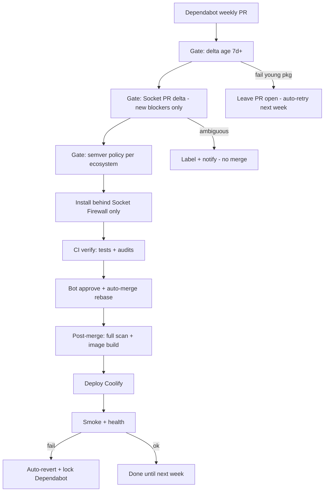

# Autonomous dependency rolling (design)

Design for **perpetual, review-free** dependency updates on Libreverse-Legacy: Dependabot PRs merge and deploy to production with **zero human approval**, as long as machine-verifiable gates pass. Humans are notified only when automation **cannot** reach a safe decision (stuck PR, policy conflict, rollback) — not for routine bumps.

**Status:** Implemented in repo (phases 1–5). Enable rolling by setting repository variable `AUTODEP_MERGE_ENABLED=true` (and optional `AUTODEP_MAJOR_MERGE_ENABLED=true`). Requires secrets: `SOCKET_API_KEY`, `APP_ID`, `APP_PRIVATE_KEY`, plus existing deploy secrets. Optional: `DEPLOY_HEALTH_URL` (defaults to `https://libreverse-legacy.geor.me/up`; smoke runs after the Cloudflare bypass step).

**TiDB pause (2026):** Serverless TiDB free tier is exhausted; the instance is shut down until credits reset (~June) to avoid accidental spend. Set repository variable `TIDB_INSTANCE_AVAILABLE=false` (default while paused). When `false`, CI skips `rails-test`, and **Build & Deploy** (Quay push, Coolify, smoke, rollback) does not run. Dependency gates and patch/minor auto-merge on PRs can still run. Set `TIDB_INSTANCE_AVAILABLE=true` when the database is back before expecting deploys or smoke to pass.

**Related:** [package-age-gates workflow](.windsurf/workflows/package-age-gates.md), `.github/dependabot.yml`, `.github/workflows/auto-approve.yml`, `.github/workflows/ci.yml`

---

## Design goal

Confidence comes from **stacked automated gates**, not from reviewing diffs.

| Principle | Meaning |
|-----------|---------|
| No review | No required PR approvals; bots merge when checks pass |
| Fail closed | If uncertain → do not merge (PR waits or auto-closes) |
| Fail safe in prod | Smoke failure → auto-revert + pause Dependabot |
| Self-healing | Stale PRs retry on schedule; young packages wait for age |

---

## What broke (May 2026)

Socket.dev added an **obfuscated code** check that produced many false positives on legitimate minified dependencies. The pipeline treated failures like hard blocks; auto-merge waited on checks; rolling was panic-disabled.

That exposed structural gaps:

1. **Age gates run on the old lockfile** — `preinstall` / `before-install-all` validate existing locks, then installers fetch tarballs and may run **install scripts** before gates see new versions.
2. **CI installs before gates** — `setup-environment` runs raw `bundle install` + `bun install` in parallel with `package-age-gates`.
3. **Deploy not gated** — `build-push` has `needs: [...]` commented out.
4. **Auto-approve broken** — `auto-approve.yml` has an empty `on:` block on `main`.
5. **Socket is not a tuned policy layer** — full-repo noise, no PR-delta semantics, no compound rules for obfuscation.

---

## Target pipeline



**Rule:** Nothing downloads or runs install scripts until **Socket Firewall** + **delta age gate** allow it.

---

## Layer 1 — Time gate

**Dependabot:** 8-day cooldown (`.github/dependabot.yml`) — keep aligned with age gate.

**Delta age gate (7 days):** On PR open, diff lockfiles against `main` and check **only new** `(name, version)` pairs via registry APIs. **No install required.**

| Script (to implement) | Purpose |
|----------------------|---------|
| `scripts/bun-age-gate-delta.mjs` | New packages in `bun.lock` vs base ref |
| `scripts/gem-age-gate-delta.rb` | New gems in `Gemfile.lock` vs base ref |

- Too young → PR stays open; weekly cron re-runs gates until versions age in.
- Replace or supplement lockfile-wide checks in `scripts/bun-age-gate.mjs` / `scripts/gem-age-gate.rb` for PR/CI use.

**Automation:** `schedule` workflow re-runs gates on open Dependabot PRs (Mondays).

---

## Layer 2 — Socket.dev (primary behavioral gate)

### A. Socket Firewall at fetch time (mandatory)

Wrap **every** install path with `sfw` ([SocketDev/action](https://github.com/SocketDev/action), [wrapper mode docs](https://docs.socket.dev/docs/socket-firewall-enterprise-wrapper-mode)):

| Surface | Today | Target |
|---------|--------|--------|
| CI `setup-environment` | raw `bundle` / `bun` | `sfw bundle` / `sfw bun` only |
| Dockerfile build | likely raw | `sfw` in build stage |
| Local dev | raw | `.sfw.config` in repo + documented aliases |

Firewall blocks at **registry fetch**, before tarball extraction and lifecycle scripts.

```yaml
# Conceptual CI
- uses: SocketDev/action@v1.3.x
  with:
    mode: firewall-enterprise
    socket-token: ${{ secrets.SOCKET_API_KEY }}
- run: sfw bundle install ...
- run: sfw bun install ...
```

Add `.sfw.config` in repo root (API key via secrets in CI; path-based config per project).

### B. PR delta scan (automated policy, not full-repo block)

On Dependabot `pull_request` / `pull_request_target`:

- Run `socketcli` (or GitHub App integration) with **new alerts only** vs baseline scan from last green `main`.
- Store baseline scan ID in repo artifact or small committed metadata file updated by bot after each successful prod deploy.

**Policy tiers (machine-enforced):**

| Category | Merge action | Notes |
|----------|--------------|-------|
| Malware, protestware, install-script takeover | **Block** | |
| Typosquat / namespace confusion (high confidence) | **Block** | |
| Obfuscated code **alone** | **Warn / ignore** | Fixes false-positive storm |
| Obfuscation **+** lifecycle script change in same package | **Block** | Shai-Hulud pattern |
| License / maintenance / reputation | **Ignore** | Log only |
| CVE (reachable) | **Block** patch/minor; defer major to semver rules | Pair with bundle-audit / npm-audit |

**No routine manual allowlist:** use compound rules. Optional: treat `package@version` already on `main` for N days as baseline-safe.

### C. Post-merge full scan

After merge to `main`, run full scan and update baseline. If registry reclassifies a package and **new blockers** appear that were not in PR delta → **auto-revert** + pause Dependabot (label `dependabot-paused`).

---

## Layer 3 — Semver automation (no human for major)

| Bump type | Auto-merge | Extra gates |
|-----------|------------|-------------|
| `github-actions` | Yes | Prefer SHA pins where possible |
| Patch (bundler / npm / docker) | Yes | Standard stack |
| Minor | Yes | Rails test + Jest green |
| **Major** | **Conditional** | Age ≥ **14 days**; Socket delta clean; smoke + build; optional CHANGELOG `BREAKING` → defer 14d and retry |

**Major safety signals (all automated):**

- App boot / routes smoke (`rails runner` or dedicated smoke suite)
- `bun run build` succeeds
- Lockfile diff size cap (reject huge accidental lock churn)
- Parse upstream CHANGELOG for `BREAKING` → defer, do not block forever

Failed major → label `automerge-deferred`; weekly cron retries.

---

## Layer 4 — CI architecture (strict order)

**Problem today:** `package-age-gates` runs **in parallel** with jobs that call `setup-environment` and install first.

**Target jobs:**

| Job | Depends on | Installs? | Work |
|-----|--------------|-----------|------|
| `gates` | — | **No** | Delta age, Socket PR delta, semver classifier |
| `install` | `gates` | Yes, **sfw only** | `sfw bundle` + `sfw bun`; upload cache artifact |
| `verify` | `install` | No (use cache) | Tests, brakeman, bundle-audit, npm-audit |
| `deploy` | `verify` (on `main` push only) | In Docker with `sfw` | Build, Quay push, Coolify |

- Re-enable `build-push` `needs: [gates, install, verify]` (or equivalent workflow_run).
- `autofix.yml` runs on `main` after merge only; not on Dependabot branches.
- Concurrency: `dependabot-${{ github.head_ref }}` to serialize bot PRs.

---

## Layer 5 — Auto-approve / auto-merge

Repair `.github/workflows/auto-approve.yml`:

```yaml
on:
  pull_request_target:
    types: [opened, synchronize, reopened]
  schedule:
    - cron: "0 6 * * 1"  # retry stale Dependabot PRs
  workflow_dispatch:
```

- GitHub App token (`APP_ID`, `APP_PRIVATE_KEY`) — merges not tied to a human account.
- Approve + `gh pr merge --rebase --delete-branch --auto` after required checks: `gates`, `verify`.
- `gh pr checks --watch --fail-fast` before merge (keep).

**Branch protection:** No required human reviewers. Required status checks = automated gates only.

---

## Layer 6 — Production safety

### Deploy gate

- Deploy only on `push` to `main` when `verify` passed for that commit.
- Skip `chore(autofix)` commits (existing pattern).
- Do not deploy Dependabot merge commits if `verify` did not run on the merge SHA (use `workflow_run` if needed).

### Post-deploy smoke + rollback

After Coolify redeploy:

1. HTTP health check (e.g. `/up`), 3 retries.
2. Optional: lightweight DB connectivity check.

**On failure:**

1. Bot `git revert` merge commit on `main`.
2. Redeploy previous image tag (store last-good deploy UUID in repo variable / secret).
3. Label `dependabot-paused`; comment with Socket scan IDs and CI links.
4. One webhook/email notification — automation halted.

---

## Layer 7 — False positives self-resolve

1. **Compound rule:** obfuscation alone never blocks; lifecycle-script change blocks.
2. **Baseline inheritance:** same `package@version` already on `main` → not a “new” alert on transitive-only bumps.
3. **API retries:** Socket flake → retry 3×, then fail closed (no merge).
4. **Chronic stuck PR:** fails gates 3+ weeks → bot closes PR with comment; Dependabot may reopen later.

**Optional:** Socket `patch` mode for verified CVE patches — bot commits patch, re-runs gates, merges.

---

## Layer 8 — Observability (minimal human attention)

| Signal | When |
|--------|------|
| Weekly digest (GitHub Issue or email) | “Merged N deps, M rollbacks, K stuck” |
| Alert (webhook) | Rollback, `dependabot-paused`, gates broken 7+ days |
| Socket + Actions dashboards | Optional |

**SLO:** ≥95% of Dependabot PRs merge within 14 days without human touch.

---

## Perpetual mode summary

| Component | Target state |
|-----------|--------------|
| Dependabot | On (weekly + 8d cooldown) |
| Auto-approve / merge | On after gates fixed |
| Socket Firewall | All installs |
| Socket PR delta | On, tuned policy |
| Age gates | Delta-only, pre-install |
| Human PR review | Off |
| Human notification | On for halt/rollback only |

---

## Implementation phases

| Phase | Autonomy | Deliverables |
|-------|----------|--------------|
| **1** | Partial | Fix `auto-approve` triggers; add `gates` workflow (delta age + Socket delta); **no merge yet** |
| **2** | High | `sfw` in CI + Dockerfile; `.sfw.config`; CI job order; Socket obfuscation compound policy |
| **3** | Full patch/minor | Auto-merge patch/minor; deploy `needs` verify; post-deploy smoke |
| **4** | Full major | Major rules + deferred retry cron |
| **5** | Self-healing | Post-merge scan regression → auto-revert |

Phase 3 = “runs forever” for typical churn. Phases 4–5 harden edge cases.

---

## Honest limits

Unattended automation cannot guarantee zero incidents. This design:

- Minimizes pre-install execution risk (Firewall)
- Avoids alert fatigue (delta + compound rules)
- Recovers from bad merges (smoke + revert)
- Fails closed when uncertain (no merge)

Expect **monthly digests** and **rare halt alerts**, not per-PR notifications.

---

## Current repo inventory (reference)

| Artifact | Role |
|----------|------|
| `.github/dependabot.yml` | Weekly updates, 8d cooldown |
| `scripts/bun-age-gate.mjs` | npm age (lockfile-wide; fix timing) |
| `scripts/gem-age-gate.rb` | gem age (lockfile-wide) |
| `plugins/bundler-age_gate/` | Bundler `before-install-all` hook |
| `package.json` `preinstall` | Runs bun age gate |
| `.github/workflows/auto-approve.yml` | Bot approve/merge (**broken `on:`**) |
| `.github/workflows/ci.yml` | CI + parallel install race |
| `.github/actions/setup-environment` | Raw install (**must use sfw**) |
| `app/views/layouts/application.html.erb` | N/A for deps |

---

## Secrets required

| Secret | Use |
|--------|-----|
| `SOCKET_API_KEY` | Firewall + socketcli |
| `APP_ID` / `APP_PRIVATE_KEY` | GitHub App merge |
| `QUAY_*`, `COOLIFY_*`, `TIDB_*` | Existing deploy/CI |
| `TIDB_INSTANCE_AVAILABLE` | Repo variable: `true` = rails-test + deploy/smoke; `false` while TiDB paused |

---

*Last updated: implementation landed — enable `AUTODEP_MERGE_ENABLED` when Socket policy is tuned in production.*
